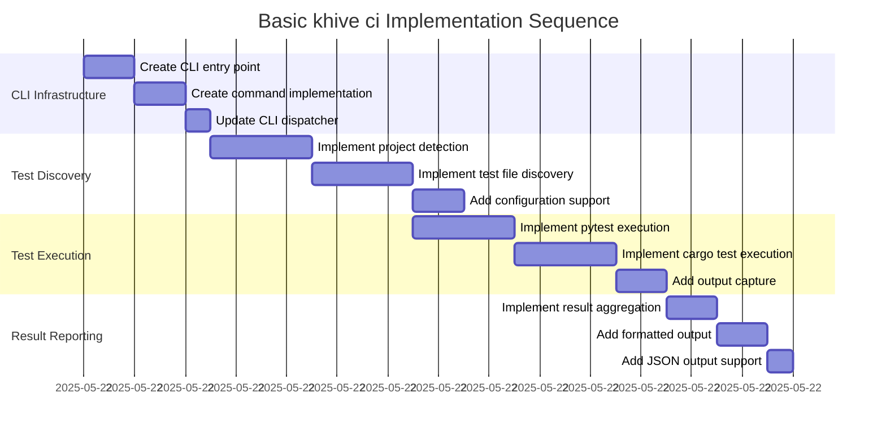

# Implementation Plan: Basic khive ci Command Structure

## 1. Overview

### 1.1 Component Purpose

Implement the foundational structure for the `khive ci` command that can
discover and execute tests for Python (pytest) and Rust (cargo test) projects.
This is the first phase of Issue #126, focusing on basic test discovery and
serial execution without iterative fixing or stamp file creation.

### 1.2 Design Reference

- Issue #126: Implement `khive ci` command with iterative auto-fixing and
  approval stamps
- Existing CLI patterns in `src/khive/cli/` and `src/khive/commands/`
- Test discovery patterns from `khive init` command

### 1.3 Implementation Approach

Following TDD methodology with:

- Test-first development for all core functionality
- Integration with existing CLI architecture
- Modular design for future extensibility
- Serial execution for simplicity in this phase

## 2. Implementation Phases

### 2.1 Phase 1: CLI Infrastructure

Create the basic CLI command structure following existing patterns.

**Key Deliverables:**

- CLI entry point in `src/khive/cli/khive_ci.py`
- Command implementation in `src/khive/commands/ci.py`
- Integration with main CLI dispatcher
- Basic argument parsing and configuration

**Dependencies:**

- Existing CLI architecture
- Argument parsing patterns from other commands

**Estimated Complexity:** Low

### 2.2 Phase 2: Test Discovery Engine

Implement test discovery for Python and Rust projects.

**Key Deliverables:**

- Project type detection (Python/Rust)
- Test file discovery mechanisms
- Configuration loading for test discovery
- Test runner validation

**Dependencies:**

- Phase 1 completion
- File system utilities
- Project structure analysis

**Estimated Complexity:** Medium

### 2.3 Phase 3: Test Execution Engine

Implement serial test execution with proper output handling.

**Key Deliverables:**

- Test execution for Python (pytest)
- Test execution for Rust (cargo test)
- Output capture and formatting
- Exit code handling

**Dependencies:**

- Phase 2 completion
- Subprocess management
- Output formatting utilities

**Estimated Complexity:** Medium

### 2.4 Phase 4: Result Reporting

Implement comprehensive result reporting and error handling.

**Key Deliverables:**

- Test result aggregation
- Human-readable output formatting
- JSON output support
- Error reporting and diagnostics

**Dependencies:**

- Phase 3 completion
- Output formatting patterns from other commands

**Estimated Complexity:** Low

## 3. Test Strategy

### 3.1 Unit Tests

#### 3.1.1 Test Group: CLI Interface

| ID   | Description                                     | Fixtures/Mocks | Assertions                          |
| ---- | ----------------------------------------------- | -------------- | ----------------------------------- |
| UT-1 | Test CLI argument parsing for valid arguments   | `mock_args`    | Arguments parsed correctly          |
| UT-2 | Test CLI argument parsing for invalid arguments | `mock_args`    | Expected exception is raised        |
| UT-3 | Test help message generation                    | None           | Help text contains expected content |

#### 3.1.2 Test Group: Test Discovery

| ID   | Description                   | Fixtures/Mocks  | Assertions                        |
| ---- | ----------------------------- | --------------- | --------------------------------- |
| UT-4 | Test Python project detection | `temp_project`  | Python project detected correctly |
| UT-5 | Test Rust project detection   | `temp_project`  | Rust project detected correctly   |
| UT-6 | Test mixed project detection  | `temp_project`  | Both project types detected       |
| UT-7 | Test no tests found scenario  | `empty_project` | Appropriate message returned      |

#### 3.1.3 Test Group: Test Execution

| ID    | Description                                  | Fixtures/Mocks    | Assertions              |
| ----- | -------------------------------------------- | ----------------- | ----------------------- |
| UT-8  | Test pytest execution with passing tests     | `mock_subprocess` | Success status returned |
| UT-9  | Test pytest execution with failing tests     | `mock_subprocess` | Failure status returned |
| UT-10 | Test cargo test execution with passing tests | `mock_subprocess` | Success status returned |
| UT-11 | Test cargo test execution with failing tests | `mock_subprocess` | Failure status returned |

### 3.2 Integration Tests

#### 3.2.1 Test Group: End-to-End Command Execution

| ID   | Description                                   | Setup                      | Assertions                     |
| ---- | --------------------------------------------- | -------------------------- | ------------------------------ |
| IT-1 | Test full command execution on Python project | Create test Python project | Command completes successfully |
| IT-2 | Test full command execution on Rust project   | Create test Rust project   | Command completes successfully |
| IT-3 | Test command execution on mixed project       | Create mixed project       | Both test suites execute       |
| IT-4 | Test command execution with no tests          | Create empty project       | Appropriate message displayed  |

### 3.3 Mock and Stub Requirements

| Dependency     | Mock/Stub Type | Key Behaviors to Mock                               |
| -------------- | -------------- | --------------------------------------------------- |
| subprocess.run | Mock           | Test execution, return codes, stdout/stderr capture |
| Path.exists    | Mock           | File/directory existence checks                     |
| Path.glob      | Mock           | Test file discovery                                 |

## 4. Implementation Tasks

### 4.1 CLI Infrastructure

| ID  | Task                          | Description                                                    | Dependencies | Priority | Complexity |
| --- | ----------------------------- | -------------------------------------------------------------- | ------------ | -------- | ---------- |
| T-1 | Create CLI entry point        | Implement `src/khive/cli/khive_ci.py` with argument parsing    | None         | High     | Low        |
| T-2 | Create command implementation | Implement `src/khive/commands/ci.py` with `cli_entry` function | T-1          | High     | Low        |
| T-3 | Update CLI dispatcher         | Add "ci" command to `src/khive/cli/khive_cli.py`               | T-2          | High     | Low        |

### 4.2 Test Discovery

| ID  | Task                          | Description                                     | Dependencies | Priority | Complexity |
| --- | ----------------------------- | ----------------------------------------------- | ------------ | -------- | ---------- |
| T-4 | Implement project detection   | Create functions to detect Python/Rust projects | T-2          | High     | Medium     |
| T-5 | Implement test file discovery | Create functions to find test files             | T-4          | High     | Medium     |
| T-6 | Add configuration support     | Support for test discovery configuration        | T-5          | Medium   | Low        |

### 4.3 Test Execution

| ID  | Task                           | Description                            | Dependencies | Priority | Complexity |
| --- | ------------------------------ | -------------------------------------- | ------------ | -------- | ---------- |
| T-7 | Implement pytest execution     | Execute pytest with proper options     | T-5          | High     | Medium     |
| T-8 | Implement cargo test execution | Execute cargo test with proper options | T-5          | High     | Medium     |
| T-9 | Add output capture             | Capture and process test output        | T-7, T-8     | High     | Medium     |

### 4.4 Result Reporting

| ID   | Task                         | Description                               | Dependencies | Priority | Complexity |
| ---- | ---------------------------- | ----------------------------------------- | ------------ | -------- | ---------- |
| T-10 | Implement result aggregation | Combine results from multiple test suites | T-9          | High     | Low        |
| T-11 | Add formatted output         | Human-readable test result output         | T-10         | High     | Low        |
| T-12 | Add JSON output support      | Machine-readable output for automation    | T-10         | Medium   | Low        |

## 5. Implementation Sequence



## 6. Acceptance Criteria

### 6.1 Command Level

| ID   | Criterion                                      | Validation Method           |
| ---- | ---------------------------------------------- | --------------------------- |
| AC-1 | Command `khive ci` executes successfully       | Integration test IT-1, IT-2 |
| AC-2 | Command discovers Python tests correctly       | Unit test UT-4, IT-1        |
| AC-3 | Command discovers Rust tests correctly         | Unit test UT-5, IT-2        |
| AC-4 | Command handles mixed projects                 | Integration test IT-3       |
| AC-5 | Command provides clear output for test results | Integration tests IT-1-IT-4 |

### 6.2 Functional Level

| ID   | Criterion                                         | Validation Method           |
| ---- | ------------------------------------------------- | --------------------------- |
| AC-6 | pytest execution returns correct exit codes       | Unit tests UT-8, UT-9       |
| AC-7 | cargo test execution returns correct exit codes   | Unit tests UT-10, UT-11     |
| AC-8 | Test output is captured and formatted correctly   | Integration tests IT-1-IT-3 |
| AC-9 | Command handles projects with no tests gracefully | Integration test IT-4       |

## 7. Test Implementation Plan

### 7.1 Test Implementation Sequence

1. Implement base test fixtures for temporary projects
2. Implement unit tests for CLI argument parsing
3. Implement unit tests for project detection
4. Implement unit tests for test execution (mocked)
5. Implement integration tests with real test projects
6. Implement performance tests for large projects

### 7.2 Test Code Examples

#### Unit Test Example - Project Detection

```python
def test_detect_python_project(tmp_path):
    # Arrange
    pyproject_toml = tmp_path / "pyproject.toml"
    pyproject_toml.write_text("[tool.pytest.ini_options]\ntestpaths = ['tests']")
    
    # Act
    result = detect_project_types(tmp_path)
    
    # Assert
    assert "python" in result
    assert result["python"]["test_command"] == "pytest"
```

#### Integration Test Example

```python
async def test_ci_command_python_project(tmp_path):
    # Arrange
    create_test_python_project(tmp_path)
    
    # Act
    result = await run_ci_command(project_root=tmp_path)
    
    # Assert
    assert result.exit_code == 0
    assert "pytest" in result.output
    assert "passed" in result.output.lower()
```

## 8. Implementation Risks and Mitigations

| Risk                                    | Impact | Likelihood | Mitigation                                                                            |
| --------------------------------------- | ------ | ---------- | ------------------------------------------------------------------------------------- |
| Test discovery fails on edge cases      | Medium | Medium     | Comprehensive unit tests for various project structures, fallback mechanisms          |
| Subprocess execution hangs or fails     | High   | Low        | Implement timeouts, proper error handling, and subprocess cleanup                     |
| Output parsing breaks with tool updates | Medium | Medium     | Use stable output formats, version-specific handling, comprehensive integration tests |

## 9. Dependencies and Environment

### 9.1 External Tools

| Tool   | Purpose               | Detection Method |
| ------ | --------------------- | ---------------- |
| pytest | Python test execution | `shutil.which`   |
| cargo  | Rust test execution   | `shutil.which`   |

### 9.2 Environment Setup

```bash
# Ensure development environment is ready
khive init

# Install test dependencies
uv sync --extra test

# Run pre-commit checks
uv run pre-commit run --all-files
```

## 10. Future Extensibility

### 10.1 Planned Extensions

- Iterative auto-fixing with convergence detection
- Approval stamp creation and validation
- Performance optimization with caching
- Support for additional test frameworks (Node.js, etc.)

### 10.2 Design Considerations

- Modular architecture for easy extension
- Plugin-based test runner system
- Configuration-driven test discovery
- Async execution support for future parallel execution

### 10.3 Integration Points

- Integration with `khive commit` for stamp validation
- Integration with `khive pr` for CI verification
- Integration with existing CLI patterns and utilities
