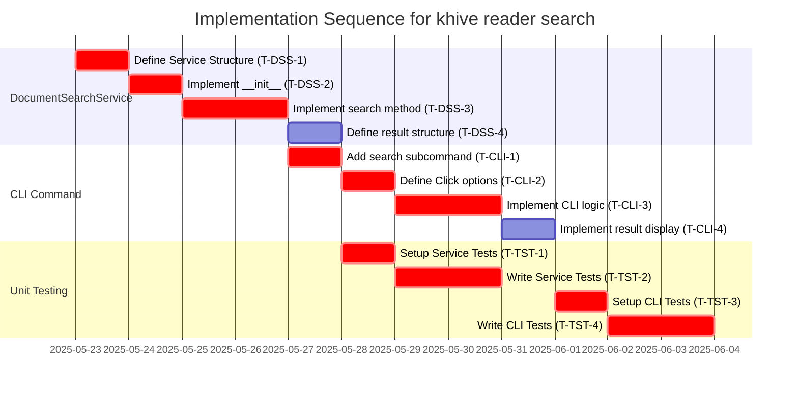

# Guidance

**Purpose** Plan out the entire coding effort before writing code. Clarify
**phases**, **tasks**, dependencies, test strategy, and acceptance criteria.

**When to Use**

- After design is approved, before actual implementation starts.

**Best Practices**

- Include TDD approach details (e.g., required test coverage).
- Provide a clear sequence of tasks.
- Reference external docs or prior designs.

---

# Implementation Plan: `khive reader search` (Issue #28)

## 1. Overview

### 1.1 Component Purpose

To implement search functionality within the `khive` Reader Microservice. This
involves creating a `DocumentSearchService` to handle query embedding and vector
similarity searches against `DocumentChunk` entities, and exposing this
functionality via a new `search` subcommand in the `khive reader` CLI.

### 1.2 Design Reference

- GitHub Issue #28: "Implement `khive reader search` command"
- (Assumed) Technical Design Specification related to Reader Service and
  pgvector integration (e.g., from Issue #25).

### 1.3 Implementation Approach

The implementation will follow a Test-Driven Development (TDD) methodology.

1. Develop the `DocumentSearchService` and its core logic.
2. Implement the `khive reader search` CLI command to utilize the service.
3. Write comprehensive unit tests for both the service and CLI components,
   aiming for ≥80% code coverage for new code. The advanced search options
   mentioned in Issue #28 will be considered a secondary goal or deferred.

## 2. Implementation Phases

### 2.1 Phase 1: `DocumentSearchService` Implementation

Description: Create the `DocumentSearchService` responsible for orchestrating
the search process. This includes generating embeddings for search queries and
interacting with the `DocumentChunkRepository` to find similar document chunks.

**Key Deliverables:**

- `DocumentSearchService` class in
  `src/khive/reader/services/search_service.py`.
- `search(query: str, document_id: Optional[UUID] = None, top_k: int = 5) -> List[Dict]`
  method.
- Integration with `EmbeddingGenerator` for query vectorization.
- Integration with `DocumentChunkRepository` for similarity search.

**Dependencies:**

- `EmbeddingGenerator` service/class (assumed to be existing and functional).
- `DocumentChunkRepository` class (assumed to be existing and functional,
  handling pgvector interactions as per Issue #25).
- `DocumentChunk` Pydantic model or SQLAlchemy model.

**Estimated Complexity:** Medium

### 2.2 Phase 2: CLI Command Implementation

Description: Add a `search` subcommand to the `khive reader` CLI. This command
will parse user input (query, filters, output format) and use the
`DocumentSearchService` to perform searches and display results.

**Key Deliverables:**

- `search` subcommand added to `reader_cli` group in
  [`src/khive/cli/khive_reader.py`](src/khive/cli/khive_reader.py:0).
- CLI arguments:
  - `query` (required, string)
  - `--document-id` (optional, UUID string)
  - `--top-k` (optional, integer, default 5)
  - `--json-output` (optional, boolean flag)
- User-friendly console output for search results (if not JSON).
- JSON formatted output when `--json-output` is specified.

**Dependencies:**

- `DocumentSearchService` (from Phase 1).
- `click` library for CLI.

**Estimated Complexity:** Low-Medium

### 2.3 Phase 3: Unit Testing

Description: Develop unit tests for all new components to ensure correctness and
achieve ≥80% code coverage.

**Key Deliverables:**

- Unit tests for `DocumentSearchService` in
  `tests/reader/services/test_search_service.py`.
- Unit tests for the `khive reader search` CLI command in
  `tests/cli/test_khive_reader.py` (or a new specific file if preferred).
- Mocks for `EmbeddingGenerator` and `DocumentChunkRepository`.

**Dependencies:**

- Completed `DocumentSearchService` and CLI command.
- `pytest` and `pytest-mock` (or equivalent).

**Estimated Complexity:** Medium

## 3. Test Strategy

### 3.1 Unit Tests

#### 3.1.1 Test Group: `DocumentSearchService` (`tests/reader/services/test_search_service.py`)

| ID       | Description                                                          | Fixtures/Mocks                                               | Assertions                                                                                                                                     |
| -------- | -------------------------------------------------------------------- | ------------------------------------------------------------ | ---------------------------------------------------------------------------------------------------------------------------------------------- |
| UT-DSS-1 | Test `search` with a valid query, default `top_k`, no `document_id`. | `mock_embedding_generator`, `mock_doc_chunk_repo`            | `generate_embedding` called once with query. `search_similar_chunks` called with correct vector and `top_k`. Returns formatted list of chunks. |
| UT-DSS-2 | Test `search` with `document_id` filter.                             | `mock_embedding_generator`, `mock_doc_chunk_repo`            | `search_similar_chunks` called with `document_id`.                                                                                             |
| UT-DSS-3 | Test `search` with a custom `top_k` value.                           | `mock_embedding_generator`, `mock_doc_chunk_repo`            | `search_similar_chunks` called with custom `top_k`.                                                                                            |
| UT-DSS-4 | Test `search` when `DocumentChunkRepository` returns an empty list.  | `mock_embedding_generator`, `mock_doc_chunk_repo`            | Returns an empty list.                                                                                                                         |
| UT-DSS-5 | Test `search` when `EmbeddingGenerator` raises an exception.         | `mock_embedding_generator` (to raise), `mock_doc_chunk_repo` | Service handles or propagates the exception appropriately.                                                                                     |
| UT-DSS-6 | Test `search` when `DocumentChunkRepository` raises an exception.    | `mock_embedding_generator`, `mock_doc_chunk_repo` (to raise) | Service handles or propagates the exception appropriately.                                                                                     |

#### 3.1.2 Test Group: `khive reader search` CLI (`tests/cli/test_khive_reader.py`)

| ID       | Description                                                             | Fixtures/Mocks                             | Assertions                                                                                                                               |
| -------- | ----------------------------------------------------------------------- | ------------------------------------------ | ---------------------------------------------------------------------------------------------------------------------------------------- |
| UT-CLI-1 | Test `khive reader search --query "test query"` (basic case).           | `Mock(DocumentSearchService)`              | `DocumentSearchService.search` called with "test query", default `top_k`, no `document_id`. Output matches expected format. Exit code 0. |
| UT-CLI-2 | Test `khive reader search --query "q" --document-id <uuid>`.            | `Mock(DocumentSearchService)`              | `DocumentSearchService.search` called with "q" and `document_id`. Exit code 0.                                                           |
| UT-CLI-3 | Test `khive reader search --query "q" --top-k 3`.                       | `Mock(DocumentSearchService)`              | `DocumentSearchService.search` called with "q" and `top_k=3`. Exit code 0.                                                               |
| UT-CLI-4 | Test `khive reader search --query "q" --json-output`.                   | `Mock(DocumentSearchService)`              | `DocumentSearchService.search` called. Output is valid JSON. Exit code 0.                                                                |
| UT-CLI-5 | Test `khive reader search --help`.                                      | None                                       | Help message displayed, contains all options. Exit code 0.                                                                               |
| UT-CLI-6 | Test `khive reader search` without `--query` (should fail).             | None                                       | CLI shows error message for missing query. Exit code non-zero.                                                                           |
| UT-CLI-7 | Test `khive reader search --query "q"` when service returns empty list. | `Mock(DocumentSearchService)` (returns []) | Appropriate "no results" message or empty JSON array. Exit code 0.                                                                       |

### 3.2 Integration Tests

No specific integration tests are planned for this IP beyond the unit tests with
mocks, as the primary focus is on the service and CLI logic. Integration with
the actual database and embedding model is assumed to be tested at a higher
level or as part of Issue #25 deliverables.

### 3.3 Mock and Stub Requirements

| Dependency                | Mock/Stub Type | Key Behaviors to Mock                                                                                                           |
| ------------------------- | -------------- | ------------------------------------------------------------------------------------------------------------------------------- |
| `EmbeddingGenerator`      | Mock           | `generate_embedding(text: str) -> List[float]`                                                                                  |
| `DocumentChunkRepository` | Mock           | `search_similar_chunks(embedding: List[float], top_k: int, document_id: Optional[UUID]) -> List[DocumentChunk]` (or List[Dict]) |

## 4. Implementation Tasks

### 4.1 `DocumentSearchService` (`src/khive/reader/services/search_service.py`)

| ID      | Task                                                              | Description                                                                                           | Dependencies | Priority | Complexity |
| ------- | ----------------------------------------------------------------- | ----------------------------------------------------------------------------------------------------- | ------------ | -------- | ---------- |
| T-DSS-1 | Define `DocumentSearchService` class structure.                   | Create the file and class outline.                                                                    | None         | High     | Low        |
| T-DSS-2 | Implement `__init__` method.                                      | Accept `EmbeddingGenerator` and `DocumentChunkRepository` instances.                                  | T-DSS-1      | High     | Low        |
| T-DSS-3 | Implement `search` method logic.                                  | Generate query embedding, call repository's search, format results. Handle `document_id` and `top_k`. | T-DSS-2      | High     | Medium     |
| T-DSS-4 | Define result structure (e.g., List of Pydantic models or dicts). | Ensure consistent output from the service.                                                            | T-DSS-3      | High     | Low        |

### 4.2 CLI Command (`src/khive/cli/khive_reader.py`)

| ID      | Task                                                                     | Description                                                                                                         | Dependencies     | Priority | Complexity |
| ------- | ------------------------------------------------------------------------ | ------------------------------------------------------------------------------------------------------------------- | ---------------- | -------- | ---------- |
| T-CLI-1 | Add `search` subcommand to `reader_cli` Click group.                     | Use `@reader_cli.command("search")`.                                                                                | None             | High     | Low        |
| T-CLI-2 | Define Click options for `query`, `document-id`, `top-k`, `json-output`. | Use `@click.option(...)`.                                                                                           | T-CLI-1          | High     | Low        |
| T-CLI-3 | Implement CLI command function logic.                                    | Instantiate `EmbeddingGenerator`, `DocumentChunkRepository`, then `DocumentSearchService`. Call `service.search()`. | T-CLI-2, T-DSS-3 | High     | Medium     |
| T-CLI-4 | Implement result display logic (console and JSON).                       | Format output based on `--json-output` flag.                                                                        | T-CLI-3          | High     | Medium     |

### 4.3 Unit Testing

| ID      | Task                                                              | Description                                              | Dependencies     | Priority | Complexity |
| ------- | ----------------------------------------------------------------- | -------------------------------------------------------- | ---------------- | -------- | ---------- |
| T-TST-1 | Create `tests/reader/services/test_search_service.py`.            | Set up test file with necessary imports and fixtures.    | T-DSS-1          | High     | Low        |
| T-TST-2 | Write unit tests for `DocumentSearchService` (as per UT-DSS-*).   | Cover all specified test cases for the service.          | T-DSS-3, T-TST-1 | High     | Medium     |
| T-TST-3 | Create/Update `tests/cli/test_khive_reader.py`.                   | Set up test file/class for CLI tests, using `CliRunner`. | T-CLI-1          | High     | Low        |
| T-TST-4 | Write unit tests for `khive reader search` CLI (as per UT-CLI-*). | Cover all specified test cases for the CLI command.      | T-CLI-4, T-TST-3 | High     | Medium     |

## 5. Implementation Sequence



## 6. Acceptance Criteria

### 6.1 Component Level (`DocumentSearchService`)

| ID     | Criterion                                                                                    | Validation Method  |
| ------ | -------------------------------------------------------------------------------------------- | ------------------ |
| AC-S-1 | `DocumentSearchService.search` returns a list of relevant document chunks for a given query. | Unit Test UT-DSS-1 |
| AC-S-2 | `search` correctly filters by `document_id` when provided.                                   | Unit Test UT-DSS-2 |
| AC-S-3 | `search` respects the `top_k` parameter.                                                     | Unit Test UT-DSS-3 |
| AC-S-4 | `search` returns an empty list when no results are found.                                    | Unit Test UT-DSS-4 |

### 6.2 CLI Level (`khive reader search`)

| ID     | Criterion                                                                                             | Validation Method  |
| ------ | ----------------------------------------------------------------------------------------------------- | ------------------ |
| AC-C-1 | `khive reader search --query "..."` executes successfully and displays formatted results.             | Unit Test UT-CLI-1 |
| AC-C-2 | `khive reader search --query "..." --document-id <uuid>` filters results.                             | Unit Test UT-CLI-2 |
| AC-C-3 | `khive reader search --query "..." --top-k <k>` limits the number of results.                         | Unit Test UT-CLI-3 |
| AC-C-4 | `khive reader search --query "..." --json-output` displays results in valid JSON format.              | Unit Test UT-CLI-4 |
| AC-C-5 | CLI command fails gracefully with appropriate error messages for invalid input (e.g., missing query). | Unit Test UT-CLI-6 |
| AC-C-6 | Code coverage for new modules/functions is ≥80%.                                                      | Coverage report    |

## 7. Test Implementation Plan

(Covered in Section 3: Test Strategy and Section 4.3: Unit Testing Tasks)

## 8. Implementation Risks and Mitigations

| Risk                                                                        | Impact | Likelihood | Mitigation                                                                                                                                    |
| --------------------------------------------------------------------------- | ------ | ---------- | --------------------------------------------------------------------------------------------------------------------------------------------- |
| Interface mismatch with `EmbeddingGenerator` or `DocumentChunkRepository`.  | Medium | Medium     | Review existing interfaces thoroughly. Implement minimal viable integration early. Communicate with respective owners if discrepancies arise. |
| Performance of vector search (primarily `DocumentChunkRepository` concern). | Low    | Low        | For this IP, assume repository handles performance. If issues arise, they would be addressed in the repository's scope (Issue #25).           |
| Defining a clear and user-friendly non-JSON output format for CLI.          | Low    | Medium     | Start with a simple format (e.g., chunk ID, score, snippet). Iterate based on usability.                                                      |
| Complexity in mocking database interactions for `DocumentChunkRepository`.  | Medium | Low        | The repository interface should abstract this. Mocks will target the repository methods directly.                                             |

## 9. Dependencies and Environment

### 9.1 External Libraries

| Library                                                                                           | Version        | Purpose                                                              |
| ------------------------------------------------------------------------------------------------- | -------------- | -------------------------------------------------------------------- |
| `click`                                                                                           | (Current Proj) | CLI framework.                                                       |
| `pydantic`                                                                                        | (Current Proj) | Data validation and models (likely for `DocumentChunk` and results). |
| `pytest`                                                                                          | (Current Proj) | Testing framework.                                                   |
| `pytest-mock`                                                                                     | (Current Proj) | Mocking utilities for testing.                                       |
| (Assumed) `pgvector` related dependencies are managed by `DocumentChunkRepository` and its setup. |                |                                                                      |

### 9.2 Environment Setup

Standard project setup using `uv`:

```bash
# Ensure virtual environment is active
# source .venv/bin/activate (if not already)

# Install/sync dependencies
uv sync
# or khive init

# Run tests
uv run pytest tests/reader/services tests/cli
```

## 10. Additional Resources

### 10.1 Reference Implementation

- Existing `khive` CLI commands (e.g., in [`src/khive/cli/`](src/khive/cli/:0))
  for Click usage.
- Existing service patterns within `src/khive/services/`.

### 10.2 Relevant Documentation

- GitHub Issue #28.
- Click documentation:
  [https://click.palletsprojects.com/](https://click.palletsprojects.com/)
- `pgvector` documentation (for understanding underlying mechanism, though
  abstracted by repository).

### 10.3 Design Patterns

- Service Layer pattern for `DocumentSearchService`.
- Repository Pattern (for `DocumentChunkRepository`, assumed).
- Dependency Injection for providing `EmbeddingGenerator` and
  `DocumentChunkRepository` to the service.
