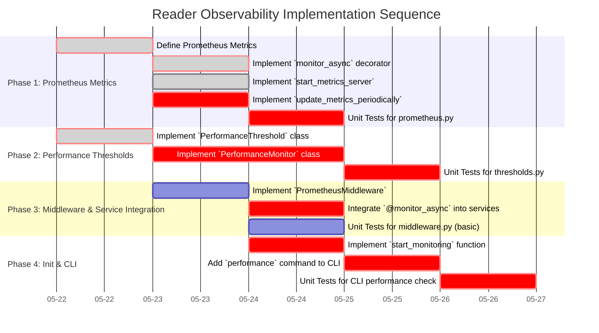

# Guidance

**Purpose** Plan out the entire coding effort before writing code. Clarify
**phases**, **tasks**, dependencies, test strategy, and acceptance criteria.

**When to Use**

- After design is approved, before actual implementation starts.

**Best Practices**

- Include TDD approach details (e.g., required test coverage).
- Provide a clear sequence of tasks.
- Reference external docs or prior designs.

---

# Implementation Plan: Reader Microservice Observability (Issue #29)

## 1. Overview

### 1.1 Component Purpose

To implement monitoring capabilities for the `khive` Reader Microservice. This
includes Prometheus metrics for various operations, performance threshold
monitoring to identify potential scaling needs, and FastAPI middleware for HTTP
request metrics.

### 1.2 Design Reference

The implementation will follow the specifications detailed in **Issue #29: "Add
observability and performance thresholds"**.

### 1.3 Implementation Approach

The approach involves creating new Python modules for Prometheus metrics,
performance thresholds, and middleware. Existing services
(`DocumentSearchService`, `DocumentProcessingService`,
`DocumentIngestionService`) will be updated to integrate monitoring decorators.
A new CLI command will be added for performance checks. Unit tests will be
written for all new components, aiming for >=80% coverage.

## 2. Implementation Phases

### 2.1 Phase 1: Prometheus Metrics Implementation

Description: Define and implement Prometheus metrics (Counters, Histograms,
Gauges) for search, ingestion, processing, vector counts, etc. Implement the
`monitor_async` decorator and the background task for periodic metric updates.

**Key Deliverables:**

- [`src/khive/reader/monitoring/prometheus.py`](src/khive/reader/monitoring/prometheus.py:0)
  with all metric definitions, `monitor_async` decorator,
  `start_metrics_server`, and `update_metrics_periodically` function.
- Unit tests for `monitor_async` and `update_metrics_periodically`.

**Dependencies:**

- `prometheus_client` library.
- Access to (mocked) DB session factory and task queue for
  `update_metrics_periodically`.

**Estimated Complexity:** Medium

### 2.2 Phase 2: Performance Thresholds Monitor Implementation

Description: Implement `PerformanceThreshold` and `PerformanceMonitor` classes
to check against predefined thresholds and log alerts.

**Key Deliverables:**

- [`src/khive/reader/monitoring/thresholds.py`](src/khive/reader/monitoring/thresholds.py:0)
  with `PerformanceThreshold` and `PerformanceMonitor` classes.
- Unit tests for threshold checking logic and alert handling.

**Dependencies:**

- Access to (mocked) DB session factory and task queue for threshold checks.

**Estimated Complexity:** Medium

### 2.3 Phase 3: Middleware and Service Integration

Description: Create FastAPI middleware for HTTP request metrics. Integrate the
`@monitor_async` decorator into existing Reader services.

**Key Deliverables:**

- [`src/khive/reader/monitoring/middleware.py`](src/khive/reader/monitoring/middleware.py:0)
  with `PrometheusMiddleware`.
- Updated `DocumentSearchService`, `DocumentProcessingService`, and
  `DocumentIngestionService` in
  [`src/khive/services/reader/`](src/khive/services/reader/:0) with
  `@monitor_async` decorator.
- Unit tests for middleware (if feasible without a full FastAPI app setup in
  this phase) and integration of decorators.

**Dependencies:**

- `fastapi` and `starlette` for middleware.
- Existing service class structures.

**Estimated Complexity:** Medium

### 2.4 Phase 4: Monitoring Initialization and CLI Integration

Description: Create an initialization function to start all monitoring
components. Update the CLI to add a `performance` command.

**Key Deliverables:**

- [`src/khive/reader/monitoring/__init__.py`](src/khive/reader/monitoring/__init__.py:0)
  with `start_monitoring` function.
- Updated [`src/khive/cli/khive_reader.py`](src/khive/cli/khive_reader.py:0)
  with the `performance` subcommand and `check_performance` async function.
- Unit tests for the `check_performance` CLI logic.

**Dependencies:**

- Existing CLI structure.

**Estimated Complexity:** Low

## 3. Test Strategy

### 3.1 Unit Tests

#### 3.1.1 Test Group: Prometheus Metrics (`prometheus.py`)

| ID    | Description                                                                    | Fixtures/Mocks                                           | Assertions                                                                                                   |
| ----- | ------------------------------------------------------------------------------ | -------------------------------------------------------- | ------------------------------------------------------------------------------------------------------------ |
| UT-P1 | Test `monitor_async` decorator increments correct counter on success           | Mock Prometheus Counter, mock async function             | Counter `inc()` called, original function result returned.                                                   |
| UT-P2 | Test `monitor_async` decorator observes correct histogram on success           | Mock Prometheus Histogram, mock async function           | Histogram `observe()` called, original function result returned.                                             |
| UT-P3 | Test `monitor_async` decorator handles exceptions and updates status           | Mock Prometheus Counter, mock async function raising exc | Counter `inc()` called with "failure" status, exception re-raised.                                           |
| UT-P4 | Test `update_metrics_periodically` updates `VECTOR_COUNT` and `DOCUMENT_COUNT` | Mock `db_session_factory`, mock `task_queue`             | `VECTOR_COUNT.set()` and `DOCUMENT_COUNT.set()` called with expected values. `TASK_QUEUE_SIZE.set()` called. |
| UT-P5 | Test `update_metrics_periodically` handles DB errors gracefully                | Mock `db_session_factory` raising exception              | Error logged, loop continues.                                                                                |

#### 3.1.2 Test Group: Performance Thresholds (`thresholds.py`)

| ID    | Description                                                                  | Fixtures/Mocks                                            | Assertions                                                                                   |
| ----- | ---------------------------------------------------------------------------- | --------------------------------------------------------- | -------------------------------------------------------------------------------------------- |
| UT-T1 | Test `PerformanceThreshold.check` when value is below threshold              | Mock `check_function` returning value below threshold     | `exceeded` is False, no alert.                                                               |
| UT-T2 | Test `PerformanceThreshold.check` when value exceeds threshold (first time)  | Mock `check_function` returning value above threshold     | `exceeded` is True, alert handler called.                                                    |
| UT-T3 | Test `PerformanceThreshold.check` when value recovers from exceeded state    | Mock `check_function` (first above, then below threshold) | `exceeded` becomes False, recovery logged.                                                   |
| UT-T4 | Test `PerformanceThreshold.check` handles exceptions in `check_function`     | Mock `check_function` raising exception                   | Error logged, `exceeded` remains unchanged or False.                                         |
| UT-T5 | Test `PerformanceMonitor.check_all_thresholds` aggregates results            | Mock `PerformanceThreshold` instances                     | Returns dict with correct status for each threshold.                                         |
| UT-T6 | Test `PerformanceMonitor` placeholder check functions return expected values | None                                                      | `_check_search_latency`, `_check_db_connection_utilization` return their placeholder values. |

#### 3.1.3 Test Group: CLI Performance Check (`khive_reader.py`)

| ID    | Description                                                                | Fixtures/Mocks                              | Assertions                                           |
| ----- | -------------------------------------------------------------------------- | ------------------------------------------- | ---------------------------------------------------- |
| UT-C1 | Test `check_performance` successfully retrieves and formats threshold data | Mock `PerformanceMonitor`                   | Returns success status and formatted threshold data. |
| UT-C2 | Test `check_performance` handles errors from `PerformanceMonitor`          | Mock `PerformanceMonitor` raising exception | Returns error status and message.                    |

### 3.2 Integration Tests

(Primarily focused on ensuring decorators are applied and metrics are exposed.
Full end-to-end with Prometheus server is out of scope for unit tests but could
be a system test.)

| ID   | Description                                                                 | Setup                                                                   | Assertions                                                                                                             |
| ---- | --------------------------------------------------------------------------- | ----------------------------------------------------------------------- | ---------------------------------------------------------------------------------------------------------------------- |
| IT-1 | Test monitored service method updates Prometheus metrics on successful call | Instrumented service (e.g., `DocumentSearchService`), Prometheus client | Relevant Prometheus Counter/Histogram is updated after calling the service method.                                     |
| IT-2 | Test `start_monitoring` initializes Prometheus server and background tasks  | Mock `start_http_server`, `asyncio.create_task`                         | `start_http_server` called, `asyncio.create_task` called for `update_metrics_periodically` and `monitor_periodically`. |

### 3.3 Mock and Stub Requirements

| Dependency                            | Mock/Stub Type | Key Behaviors to Mock                                                      |
| ------------------------------------- | -------------- | -------------------------------------------------------------------------- |
| `prometheus_client` (Metrics)         | Mock           | `inc()`, `observe()`, `set()` methods of Counter, Histogram, Gauge.        |
| DB Session Factory (`get_db_session`) | Mock           | Async context manager returning a mock session with an `execute()` method. |
| Task Queue (`task_queue`)             | Mock           | `pending_tasks` attribute (list-like).                                     |
| `asyncio.sleep`                       | Mock           | To speed up tests involving periodic tasks.                                |
| `logging`                             | Mock           | To check for specific log messages (warnings, errors).                     |
| `fastapi.Request`, `call_next`        | Mock           | For `PrometheusMiddleware` unit tests.                                     |

## 4. Implementation Tasks

### 4.1 Monitoring Core (`prometheus.py`, `thresholds.py`, `middleware.py`, `__init__.py`)

| ID   | Task                                    | Description                                                                                                                             | Dependencies     | Priority | Complexity |
| ---- | --------------------------------------- | --------------------------------------------------------------------------------------------------------------------------------------- | ---------------- | -------- | ---------- |
| T-P1 | Define Prometheus Metrics               | Implement all `Counter`, `Histogram`, `Gauge` objects in [`prometheus.py`](src/khive/reader/monitoring/prometheus.py:0).                | None             | High     | Low        |
| T-P2 | Implement `monitor_async` decorator     | Create the decorator in [`prometheus.py`](src/khive/reader/monitoring/prometheus.py:0).                                                 | T-P1             | High     | Medium     |
| T-P3 | Implement `start_metrics_server`        | Create the function in [`prometheus.py`](src/khive/reader/monitoring/prometheus.py:0).                                                  | T-P1             | High     | Low        |
| T-P4 | Implement `update_metrics_periodically` | Create the background task in [`prometheus.py`](src/khive/reader/monitoring/prometheus.py:0).                                           | T-P1             | High     | Medium     |
| T-T1 | Implement `PerformanceThreshold` class  | Create the class in [`thresholds.py`](src/khive/reader/monitoring/thresholds.py:0).                                                     | None             | High     | Medium     |
| T-T2 | Implement `PerformanceMonitor` class    | Create the class, including check methods and `monitor_periodically` in [`thresholds.py`](src/khive/reader/monitoring/thresholds.py:0). | T-T1             | High     | Medium     |
| T-M1 | Implement `PrometheusMiddleware`        | Create the middleware class in [`middleware.py`](src/khive/reader/monitoring/middleware.py:0).                                          | T-P1             | Medium   | Medium     |
| T-I1 | Implement `start_monitoring` function   | Create the initialization function in [`src/khive/reader/monitoring/__init__.py`](src/khive/reader/monitoring/__init__.py:0).           | T-P3, T-P4, T-T2 | High     | Low        |

### 4.2 Service and CLI Integration

| ID   | Task                                     | Description                                                                                                                     | Dependencies | Priority | Complexity |
| ---- | ---------------------------------------- | ------------------------------------------------------------------------------------------------------------------------------- | ------------ | -------- | ---------- |
| T-S1 | Integrate `@monitor_async` into services | Add decorator to `search`, `process_document`, `ingest_document` methods in respective service files.                           | T-P2         | High     | Low        |
| T-C1 | Add `performance` command to CLI         | Update [`src/khive/cli/khive_reader.py`](src/khive/cli/khive_reader.py:0) with new subcommand and `check_performance` function. | T-T2         | High     | Medium     |

### 4.3 Unit Testing

| ID   | Task                                         | Description                                                                              | Dependencies | Priority | Complexity |
| ---- | -------------------------------------------- | ---------------------------------------------------------------------------------------- | ------------ | -------- | ---------- |
| T-U1 | Write unit tests for `prometheus.py`         | Cover `monitor_async`, `update_metrics_periodically`.                                    | T-P2, T-P4   | High     | Medium     |
| T-U2 | Write unit tests for `thresholds.py`         | Cover `PerformanceThreshold`, `PerformanceMonitor`.                                      | T-T1, T-T2   | High     | Medium     |
| T-U3 | Write unit tests for CLI performance check   | Cover `check_performance` logic in [`khive_reader.py`](src/khive/cli/khive_reader.py:0). | T-C1         | High     | Low        |
| T-U4 | Write unit tests for `middleware.py` (basic) | Cover basic metric updates in `PrometheusMiddleware`.                                    | T-M1         | Medium   | Low        |

## 5. Implementation Sequence



## 6. Acceptance Criteria

### 6.1 Component Level

| ID   | Criterion                                                                   | Validation Method                                                              |
| ---- | --------------------------------------------------------------------------- | ------------------------------------------------------------------------------ |
| AC-1 | Prometheus metrics (`SEARCH_REQUESTS`, `SEARCH_LATENCY`, etc.) are defined. | Code review of [`prometheus.py`](src/khive/reader/monitoring/prometheus.py:0). |
| AC-2 | `@monitor_async` correctly wraps async functions and updates metrics.       | Unit tests UT-P1, UT-P2, UT-P3.                                                |
| AC-3 | `update_metrics_periodically` updates gauges correctly.                     | Unit test UT-P4.                                                               |
| AC-4 | `PerformanceThreshold` correctly identifies exceeded/recovered states.      | Unit tests UT-T1, UT-T2, UT-T3.                                                |
| AC-5 | `PerformanceMonitor` checks all thresholds and reports status.              | Unit test UT-T5.                                                               |
| AC-6 | `PrometheusMiddleware` updates HTTP metrics.                                | Unit test T-U4 (basic), manual test if possible.                               |
| AC-7 | `start_monitoring` initializes all components.                              | Integration test IT-2.                                                         |
| AC-8 | CLI `performance` command displays threshold status.                        | Unit test UT-C1, manual CLI execution.                                         |

### 6.2 API Level (Conceptual, as full API is future)

| ID   | Criterion                                                               | Validation Method                                |
| ---- | ----------------------------------------------------------------------- | ------------------------------------------------ |
| AC-9 | HTTP requests to a (future) FastAPI app are instrumented by middleware. | Manual test with a simple FastAPI app if set up. |

## 7. Test Implementation Plan

(Covered in section 3.1, 3.2, 3.3 and task list 4.3)

## 8. Implementation Risks and Mitigations

| Risk                                                   | Impact | Likelihood | Mitigation                                                                                               |
| ------------------------------------------------------ | ------ | ---------- | -------------------------------------------------------------------------------------------------------- |
| Complexity in mocking async DB/task queue interactions | Medium | Medium     | Use `unittest.mock.AsyncMock` and carefully design mock interfaces. Refer to `aiounittest` if needed.    |
| Difficulty testing periodic background tasks           | Medium | Medium     | Mock `asyncio.sleep`, control loop iterations in tests, check state after specific number of "ticks".    |
| Integration issues with existing services              | Low    | Low        | Ensure decorator signature compatibility. Existing service logic is not modified, only wrapped.          |
| `prometheus_client` or `fastapi` version conflicts     | Low    | Low        | Dependencies are standard; `uv sync` should handle resolution. Check `pyproject.toml` for compatibility. |

## 9. Dependencies and Environment

### 9.1 External Libraries

| Library             | Version          | Purpose                                |
| ------------------- | ---------------- | -------------------------------------- |
| `prometheus-client` | (latest stable)  | Prometheus metrics exposition          |
| `fastapi`           | (as per project) | For `PrometheusMiddleware` (Starlette) |
| `starlette`         | (as per project) | For `BaseHTTPMiddleware`               |
| `asyncio`           | (built-in)       | Core async operations                  |

### 9.2 Environment Setup

Standard Python environment setup using `uv`.

```bash
# Assuming project uses uv and pyproject.toml
uv venv
source .venv/bin/activate
uv sync # To install dependencies including new ones
# Add prometheus-client to pyproject.toml
uv add prometheus-client
```

## 10. Additional Resources

### 10.1 Reference Implementation

- Issue #29 content provides the core implementation snippets.

### 10.2 Relevant Documentation

- [Prometheus Python Client](https://github.com/prometheus/client_python)
- [FastAPI Middleware](https://fastapi.tiangolo.com/tutorial/middleware/)

### 10.3 Design Patterns

- Decorator (for `monitor_async`)
- Observer (implicitly, for metrics and thresholds)
- Background Task / Scheduled Task (for periodic updates)
