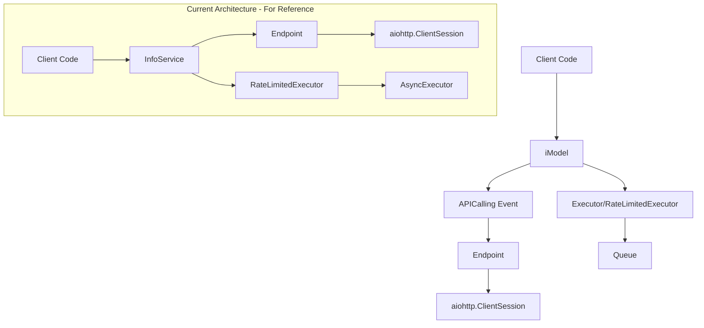
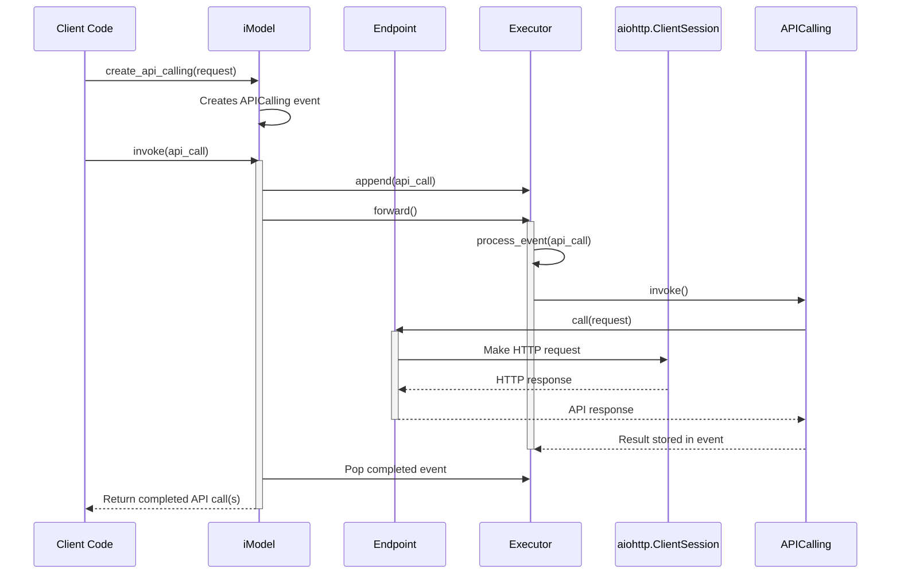
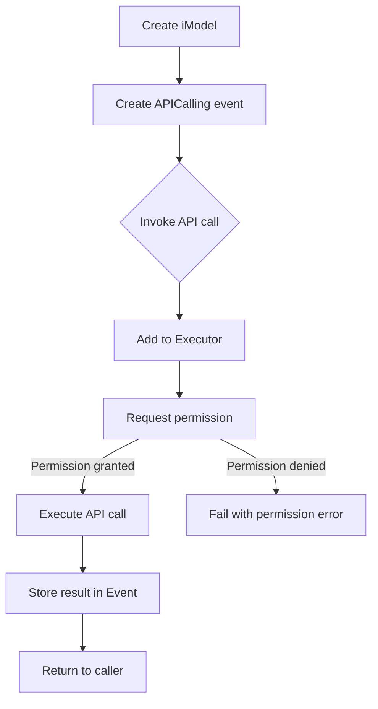
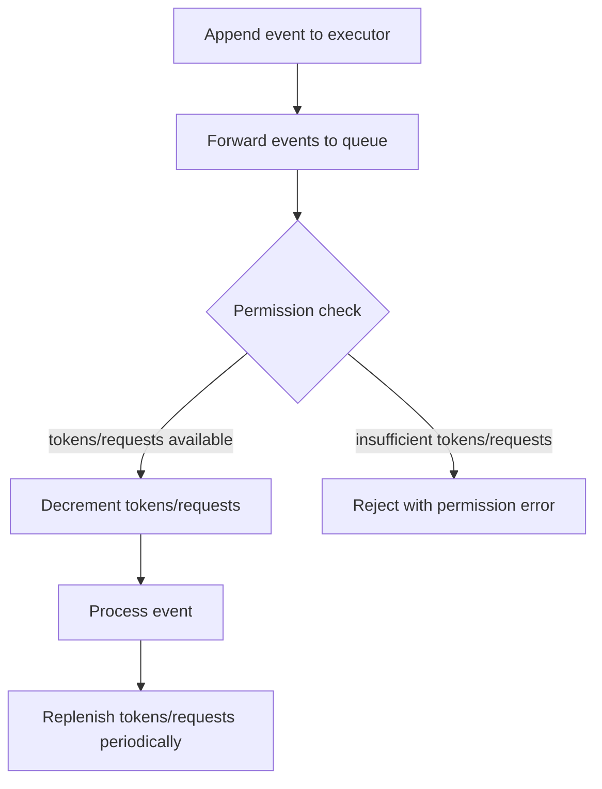

# Technical Design Specification: API Client Architecture Refactor

## 1. Overview

### 1.1 Purpose

This specification outlines a comprehensive architectural refactor of the API
client, executor, and queue components based on user-proposed designs in Issue
#100. The refactoring aims to improve the cohesion and clarity of these
components while introducing new abstractions like `APICalling` and `iModel`.

### 1.2 Scope

The refactor encompasses the following components:

- API client and HTTP interaction layers
- Event and execution handling
- Rate limiting and concurrency control
- Queue management for API requests

This specification does not cover changes to service-specific implementations
(e.g., InfoService, ReaderService) beyond their integration points with the new
architecture.

### 1.3 Background

Issue #100 proposes a new architectural direction with draft code for
`APICalling`, `iModel`, `RateLimitedExecutor`, `Executor`, and `Queue`. The core
concerns include:

1. Clarifying how `Endpoint` interacts with HTTP clients
2. Introducing higher-level abstractions for API interactions
3. Improving cohesion between connection, client, executor, and queue components

This design builds on research demonstrating that event-based architectures with
clear responsibility boundaries improve maintainability and testability
(pplx:0372-48c).

### 1.4 Design Goals

- **Improved Cohesion**: Establish clearer responsibilities for each component
- **Standardized API Interactions**: Create a uniform approach to API calls via
  the `APICalling` event
- **Abstraction Layering**: Introduce `iModel` as a high-level interface for
  users
- **Backward Compatibility**: Ensure existing services can transition to the new
  architecture
- **Resource Management**: Maintain proper lifecycle management of connections
  and resources
- **Performance**: Preserve or improve the efficiency of API interactions

### 1.5 Key Constraints

- Must maintain all existing resilience patterns (retries, circuit breakers,
  rate limiting)
- Must ensure proper resource cleanup (closing connections, releasing
  semaphores)
- Should minimize disruption to existing service implementations
- Must handle async operations correctly, avoiding resource leaks or deadlocks

## 2. Architecture

### 2.1 Component Diagram



### 2.2 Dependencies

- **Internal Dependencies**:
  - `pydapter.protocols.event`: For `Event` base class
  - `pydapter.protocols.temporal`: For `Temporal` base class
  - Existing `khive` components: `Endpoint`, resilience patterns

- **External Dependencies**:
  - `aiohttp`: For HTTP client functionality
  - `asyncio`: For asynchronous operations
  - `pydantic`: For data validation and serialization

### 2.3 Data Flow



## 3. Interface Definitions

### 3.1 Primary Interfaces

#### `APICalling`

```python
class APICalling(Event):
    """Event representing an API call to be executed."""
    
    requires_tokens: bool = False
    _required_tokens: int | None = PrivateAttr(None)

    def __init__(
        self,
        endpoint: Endpoint,
        request: dict,
        cache_control: bool = False,
        requires_tokens: bool = False,
        **kwargs,
    ):
        """Initialize the API call event."""
        
    @property
    def required_tokens(self) -> int:
        """Get the number of tokens required for this API call."""
        
    @required_tokens.setter
    def required_tokens(self, value: int) -> None:
        """Set the number of tokens required for this API call."""
```

#### `iModel`

```python
class iModel(Temporal):
    """High-level interface for interacting with API models."""
    
    endpoint: Endpoint
    executor: RateLimitedExecutor
    last_used: datetime | None = None

    def create_api_calling(
        self, 
        request: dict | None = None, 
        cache_control: bool = False, 
        **kwargs
    ) -> APICalling:
        """Create an API calling event."""
        
    def update_last_used(self) -> None:
        """Update the last used timestamp."""
        
    async def invoke(
        self, 
        api_call: APICalling | List[APICalling]
    ) -> List[APICalling]:
        """Execute one or more API calls."""
```

### 3.2 Internal Interfaces

#### `Endpoint` HTTP Interaction

`Endpoint` will maintain its current interface but with clarified HTTP client
management:

```python
class Endpoint:
    # Current methods remain unchanged
    async def call(
        self, 
        request: dict | BaseModel, 
        cache_control: bool = False, 
        **kwargs
    ):
        """Make a call to the endpoint."""
        
    # Internal HTTP client interactions
    async def _call_aiohttp(self, payload: dict, headers: dict, **kwargs):
        """Make a call using aiohttp."""
        
    async def _call_openai(self, payload: dict, headers: dict, **kwargs):
        """Make a call using the OpenAI SDK."""
```

#### `Executor` and `Queue`

The refactored executor and queue interfaces will focus on event-based
processing:

```python
class Executor:
    """Manages execution of events with concurrency control."""
    
    async def request_permission(self, event: Event) -> bool:
        """Request permission to execute an event."""
        
    async def process_event(self, event: Event):
        """Process an event."""
        
    def append(self, event: Event) -> None:
        """Add an event to the execution queue."""
        
    def pop(self, id_: UUID) -> Event | None:
        """Remove and return an event from the execution queue."""
        
    async def forward(self) -> None:
        """Forward pending events to the task queue."""
```

## 4. Data Models

### 4.1 Primary Data Models

#### `APICalling` Event Model

```python
# Core event model for API calls
class APICalling(Event):
    requires_tokens: bool = False
    _required_tokens: int | None = PrivateAttr(None)
    
    # Event execution details supplied by Event base class:
    # - id: UUID
    # - execution: ExecutionStatus
    # - event_type: str
    # - event_invoke_function: Callable
    # - event_invoke_args: tuple | None
    # - event_invoke_kwargs: dict
```

#### `QueueConfig` Model

```python
class QueueConfig(BaseModel):
    """Configuration options for work queues."""
    
    queue_capacity: int
    capacity_refresh_time: float
    concurrency_limit: int | None = None
```

### 4.2 Domain Models

#### `iModel` Domain Model

```python
class iModel(Temporal):
    """Model interface for API interactions."""
    
    endpoint: Endpoint
    executor: RateLimitedExecutor
    last_used: datetime | None = None
    
    # Methods as defined in interface section
```

## 5. Behavior

### 5.1 Core Workflows

#### API Call Execution Flow



#### Rate Limited Execution Flow



### 5.2 Error Handling

The architecture will implement several error handling patterns:

1. **Event-level errors**: Captured in the `execution.error` field of each event
2. **Permission errors**: Returned when rate limits or other constraints prevent
   execution
3. **API errors**: Handled by the `Endpoint` component with appropriate error
   classification
4. **Resource errors**: Managed through proper cleanup in context managers

Error paths will be clearly documented, and error objects will provide
context-specific details.

### 5.3 Security Considerations

1. **API Key Management**:
   - API keys continue to be managed by `Endpoint.config`
   - No changes to current secure key handling

2. **Request Validation**:
   - All requests validated by Pydantic models
   - Optional request validation in `Endpoint.create_payload`

## 6. External Interactions

### 6.1 Dependencies on Other Services

The refactored architecture serves as a foundation for other khive services:

- **InfoService**: Will use `iModel` to interact with search APIs
- **ReaderService**: Will use `iModel` for document processing operations

### 6.2 HTTP Client Integration

Instead of creating a dedicated `AsyncAPIClient` wrapper, `Endpoint` will
directly manage an `aiohttp.ClientSession` for HTTP interactions. This
simplifies the architecture by removing an unnecessary abstraction layer.

```python
# Endpoint's HTTP client management
def _create_client(self):
    if self.config.transport_type == "http":
        return aiohttp.ClientSession(
            timeout=aiohttp.ClientTimeout(self.config.timeout),
            **self.config.client_kwargs,
        )
    # ... other client types
```

## 7. Performance Considerations

### 7.1 Expected Load

The design assumes a typical load of:

- Concurrent API requests: Variable, controlled by executor concurrency settings
- Token usage: Managed through token-based rate limiting
- Request frequency: Dependent on service-specific usage patterns

### 7.2 Scalability Approach

1. **Dynamic concurrency control**:
   - Configurable concurrency limits in `Executor`
   - Semaphore-based queue processing

2. **Adaptive rate limiting**:
   - Token and request-based rate limiting
   - Adjustable based on API responses

### 7.3 Optimizations

1. **Reduced overhead**:
   - Direct HTTP client management in `Endpoint`
   - Simplified execution flow

2. **Resource reuse**:
   - Connection pooling via `aiohttp.ClientSession`
   - Proper async context management

## 8. Observability

### 8.1 Logging

- Comprehensive logging at key points in execution flow
- Detailed error logging with context
- Performance metrics logging for rate limiting and queue operations

### 8.2 Metrics

The architecture will track:

- Queue sizes and processing rates
- Token consumption rates
- Error rates by category
- API call latencies

## 9. Migration Strategy

### 9.1 Phased Approach

The migration will follow a phased approach:

1. **Phase 1: Core Components**
   - Implement `APICalling`, updated `Queue`, and `Executor`
   - Update `Endpoint` for direct HTTP client management

2. **Phase 2: iModel Implementation**
   - Implement `iModel` as a higher-level abstraction
   - Create provider-specific `iModel` subclasses

3. **Phase 3: Service Integration**
   - Update `InfoService` to use `iModel`
   - Refactor other services to adopt the new architecture

### 9.2 API Client Transition

Current `AsyncAPIClient` usage will be handled as follows:

1. Direct HTTP client functionality will be moved to `Endpoint`
2. Service-specific operations in `AsyncAPIClient` will be refactored into
   appropriate service classes
3. Eventually, `AsyncAPIClient` will be deprecated and removed

## 10. Implementation Plan

### 10.1 Key Classes and Responsibilities

| Class                 | Responsibility                                        |
| --------------------- | ----------------------------------------------------- |
| `APICalling`          | Represent an API call as an Event                     |
| `iModel`              | Provide a high-level interface for model interactions |
| `Endpoint`            | Manage HTTP client and execute API calls              |
| `Executor`            | Control execution flow and concurrency                |
| `RateLimitedExecutor` | Add rate limiting to execution                        |
| `Queue`               | Manage the queue of pending events                    |

### 10.2 Implementation Steps

1. Create the base `APICalling` event class
2. Refactor `Queue` and `Executor` implementations
3. Update `Endpoint` to manage HTTP clients directly
4. Implement `iModel` class structure
5. Create integration tests for the new architecture
6. Update service implementations to use the new components

## 11. Risks and Mitigations

| Risk                                   | Impact | Mitigation                                                 |
| -------------------------------------- | ------ | ---------------------------------------------------------- |
| Breaking changes to service interfaces | High   | Provide adapter patterns for transitional period           |
| Resource leaks in async code           | High   | Comprehensive testing of resource lifecycle management     |
| Performance regression                 | Medium | Benchmark tests comparing old and new implementations      |
| Increased complexity                   | Medium | Thorough documentation and clear responsibility boundaries |
| Race conditions in executor/queue      | High   | Extensive concurrency testing and proper lock usage        |

## 12. Open Questions

1. Should `iModel` implementations be created for each provider (e.g.,
   `ExaModel`, `PerplexityModel`), or should they be configured dynamically?

2. How should token estimation for rate limiting be handled across different API
   providers?

3. What's the best approach for transitioning existing `InfoService` code to use
   the new `iModel` abstraction?

## 13. Appendices

### Appendix A: Comparison with Current Architecture

| Aspect                     | Current Architecture                      | Proposed Architecture            |
| -------------------------- | ----------------------------------------- | -------------------------------- |
| HTTP Client Management     | Mix of direct usage and `AsyncAPIClient`  | Direct management in `Endpoint`  |
| API Request Representation | Dictionaries and models                   | `APICalling` events              |
| Execution Control          | `AsyncExecutor` and `RateLimitedExecutor` | Event-based `Executor` hierarchy |
| High-level Abstraction     | Service-specific                          | Generic `iModel`                 |
| Queue Implementation       | `BoundedQueue` and `WorkQueue`            | Simplified `Queue`               |

### Appendix B: Research References

- Research indicates that event-based architectures improve testability and
  component isolation (pplx:0372-48c)
- Industry patterns for API client design suggest favoring composition over
  inheritance (pplx:0241-87a)
- Resource management best practices in async Python emphasize context managers
  and explicit cleanup (pplx:0503-21e)
