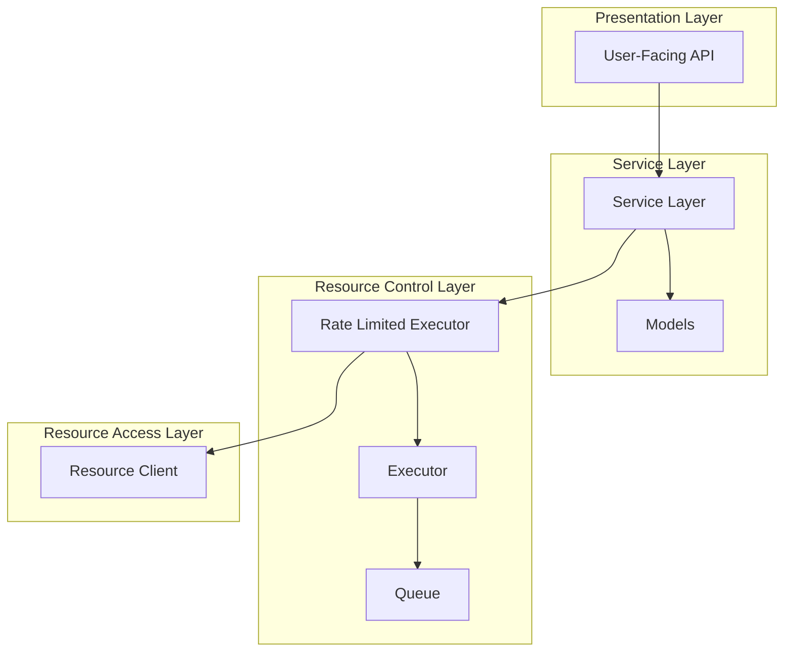
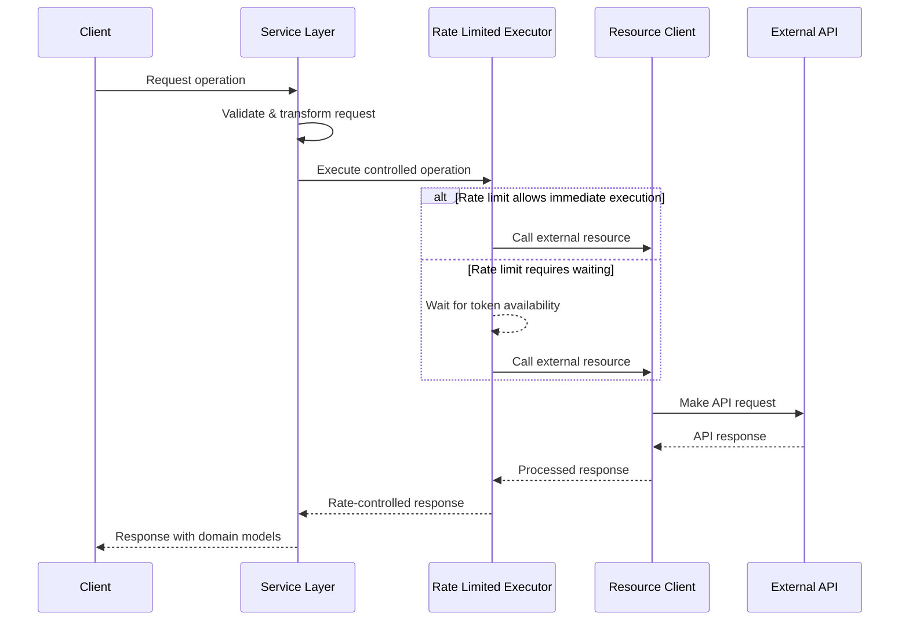
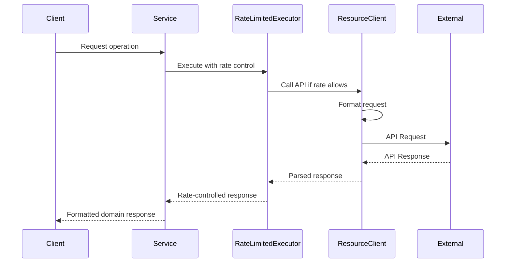
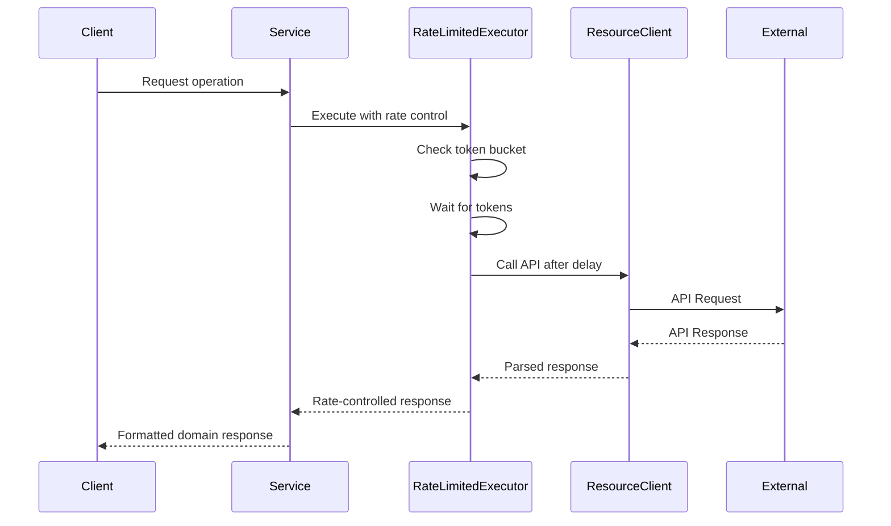

# Technical Design Specification: Layered Resource Control Architecture

## 1. Overview

### 1.1 Purpose

Define a comprehensive layered architecture pattern for the async resource
control system, establishing clear separation of concerns and component
responsibilities to ensure reliable, maintainable, and efficient access to
external resources.

### 1.2 Scope

This specification covers:

- The overall layered architecture pattern
- Component responsibilities and interfaces
- Implementation patterns for rate limiting and concurrency control
- Error handling and resilience mechanisms
- Integration with existing codebase

This specification does not cover:

- Specific UI components or user interactions
- Deployment infrastructure details
- Authentication and authorization mechanisms (beyond API key handling)

### 1.3 Background

The current implementation includes components for API calls, model definitions,
rate-limited execution, and queuing, but would benefit from a more formalized
architecture with clearly defined interfaces and responsibilities. This need was
identified in Issue #80.

The existing code in `src/khive/connections/` and `src/khive/services/`
demonstrates patterns that can be extended and formalized in this architecture.

### 1.4 Design Goals

- **Separation of concerns**: Each component should have a clear, single
  responsibility
- **Resilience**: Gracefully handle failures in external resources
- **Efficiency**: Optimize resource usage and prevent overwhelming external
  services
- **Maintainability**: Enable independent evolution of components
- **Testability**: Support unit testing of components in isolation
- **Extensibility**: Allow for adding new resource types and rate limiting
  strategies

### 1.5 Key Constraints

- Must support asynchronous operations with Python's asyncio
- Must handle rate limits of various external APIs
- Must provide backpressure mechanisms to prevent overload
- Must ensure proper resource cleanup in all circumstances
- Must be compatible with existing codebase patterns

## 2. Architecture

### 2.1 Component Diagram



### 2.2 Dependencies

- **Internal**:
  - Python 3.10+ asyncio
  - Pydantic for model validation
  - Existing `khive` infrastructure

- **External**:
  - `httpx` for async HTTP requests
  - `backoff` for retry mechanisms
  - `aiocache` for caching responses
  - Various API provider libraries (as needed)

### 2.3 Data Flow



## 3. Interface Definitions

### 3.1 Component Interfaces

#### 3.1.1 ResourceClient Interface

```python
from typing import Protocol, TypeVar, Any, Awaitable

T = TypeVar('T')

class ResourceClient(Protocol):
    async def call(self, request: Any, **kwargs) -> Any: ...
    async def close(self) -> None: ...
    async def __aenter__(self) -> 'ResourceClient': ...
    async def __aexit__(self, *args) -> None: ...
```

#### 3.1.2 Executor Interface

```python
from typing import Protocol, TypeVar, Any, Awaitable, Callable

T = TypeVar('T')

class Executor(Protocol):
    async def execute(self, func: Callable[..., Awaitable[T]], *args: Any, **kwargs: Any) -> T: ...
    async def shutdown(self, timeout: float = None) -> None: ...
```

#### 3.1.3 RateLimiter Interface

```python
from typing import Protocol, TypeVar, Any, Awaitable, Callable

T = TypeVar('T')

class RateLimiter(Protocol):
    async def acquire(self, tokens: float = 1.0) -> float: ...
    async def execute(self, func: Callable[..., Awaitable[T]], *args: Any, **kwargs: Any) -> T: ...
```

#### 3.1.4 Queue Interface

```python
from typing import Protocol, TypeVar, Callable, Awaitable, Any

T = TypeVar('T')

class Queue(Protocol):
    async def put(self, item: T) -> bool: ...
    async def get(self) -> T: ...
    def task_done(self) -> None: ...
    async def join(self) -> None: ...
    async def start_workers(self, worker_func: Callable[[T], Awaitable[Any]], num_workers: int) -> None: ...
    async def stop_workers(self, timeout: float = None) -> None: ...
```

#### 3.1.5 Service Interface

```python
from typing import Protocol, TypeVar, Any

T = TypeVar('T')
R = TypeVar('R')

class Service(Protocol):
    async def handle_request(self, request: T) -> R: ...
```

### 3.2 API Usage Examples

```python
# Example: Service using rate-limited resource client
class APIService:
    def __init__(self, client: ResourceClient, executor: Executor, rate_limiter: RateLimiter):
        self.client = client
        self.executor = executor
        self.rate_limiter = rate_limiter
    
    async def call(self, request):
        return await self.rate_limiter.execute(
            self.executor.execute,
            self.client.call,
            request
        )

# Example: Using the service with async context manager
async def example_usage():
    async with APIService() as service:
        # Resources automatically cleaned up
        result = await service.call(request)
```

## 4. Data Models

### 4.1 Core Models

#### 4.1.1 Request Model

```python
from pydantic import BaseModel
from typing import Dict, Any
from datetime import datetime

class RequestModel(BaseModel):
    """Base model for API requests."""
    request_id: str
    timestamp: datetime = datetime.now()
    
    class Config:
        frozen = True  # Make instances immutable
```

#### 4.1.2 Response Model

```python
class ResponseModel(BaseModel):
    """Base model for API responses."""
    response_id: str
    request_id: str
    timestamp: datetime
    status: str
    data: Dict[str, Any]
    
    class Config:
        frozen = True
```

#### 4.1.3 Endpoint Configuration Model

```python
from pydantic import BaseModel, Field, PrivateAttr, SecretStr
from typing import Optional, Dict, Any, Literal

class EndpointConfig(BaseModel):
    name: str
    provider: str
    transport_type: Literal["http", "sdk"] = "http"
    base_url: Optional[str] = None
    endpoint: str
    method: str = "POST"
    content_type: str = "application/json"
    auth_type: str = "bearer"
    api_key: Optional[str] = None
    timeout: int = 300
    max_retries: int = 3
    default_headers: Dict[str, str] = Field(default_factory=dict)
    client_kwargs: Dict[str, Any] = Field(default_factory=dict)
    _api_key: Optional[str] = PrivateAttr(None)
```

## 5. Component Implementations

### 5.1 ResourceClient Implementation

The ResourceClient handles direct interaction with external APIs, including:

- Session management and connection pooling
- HTTP request/response handling
- Authentication
- Serialization/deserialization

```python
import httpx
import asyncio
from typing import Optional, Dict, Any

class AsyncAPIClient:
    """Generic async HTTP client for API interactions."""
    def __init__(self, base_url: str, timeout: float = 10.0):
        self.base_url = base_url
        self.timeout = timeout
        self._session: Optional[httpx.AsyncClient] = None
        self._session_lock = asyncio.Lock()
        
    async def _get_session(self) -> httpx.AsyncClient:
        """Get or create the shared session."""
        async with self._session_lock:
            if self._session is None:
                self._session = httpx.AsyncClient(
                    base_url=self.base_url,
                    timeout=self.timeout
                )
            return self._session
    
    async def close(self) -> None:
        """Close the client session."""
        async with self._session_lock:
            if self._session is not None:
                await self._session.aclose()
                self._session = None
    
    async def get(self, path: str, params: Optional[Dict[str, Any]] = None) -> Dict[str, Any]:
        """Make a GET request to the API."""
        session = await self._get_session()
        response = await session.get(path, params=params)
        response.raise_for_status()
        return response.json()
        
    async def post(self, path: str, data: Dict[str, Any]) -> Dict[str, Any]:
        """Make a POST request to the API."""
        session = await self._get_session()
        response = await session.post(path, json=data)
        response.raise_for_status()
        return response.json()
    
    async def __aenter__(self):
        await self._get_session()
        return self
        
    async def __aexit__(self, exc_type, exc_val, exc_tb):
        await self.close()
```

### 5.2 Rate Limiter Implementation

The Rate Limiter manages resource usage by controlling the frequency of
operations, using the token bucket algorithm (pplx:84684e8d) for smooth traffic
shaping:

```python
import time
import asyncio
from typing import Callable, TypeVar, Any, Awaitable, Optional

T = TypeVar('T')

class TokenBucketRateLimiter:
    """
    Rate limiter using token bucket algorithm.
    """
    def __init__(
        self, 
        rate: float, 
        period: float = 1.0, 
        max_tokens: Optional[float] = None
    ):
        """
        Initialize rate limiter.
        
        Args:
            rate: Maximum number of tokens per period
            period: Time period in seconds
            max_tokens: Maximum token bucket capacity (defaults to rate)
        """
        self.rate = rate
        self.period = period
        self.max_tokens = max_tokens if max_tokens is not None else rate
        self.tokens = self.max_tokens
        self.last_refill = time.monotonic()
        self._lock = asyncio.Lock()
    
    async def _refill(self) -> None:
        """Refill tokens based on elapsed time."""
        now = time.monotonic()
        elapsed = now - self.last_refill
        new_tokens = elapsed * (self.rate / self.period)
        
        if new_tokens > 0:
            self.tokens = min(self.tokens + new_tokens, self.max_tokens)
            self.last_refill = now
    
    async def acquire(self, tokens: float = 1.0) -> float:
        """
        Acquire tokens from the bucket.
        
        Args:
            tokens: Number of tokens to acquire
            
        Returns:
            Wait time in seconds before tokens are available
        """
        async with self._lock:
            await self._refill()
            
            if self.tokens >= tokens:
                self.tokens -= tokens
                return 0.0
            
            # Calculate wait time until enough tokens are available
            deficit = tokens - self.tokens
            wait_time = deficit * self.period / self.rate
            return wait_time
            
    async def execute(
        self, 
        func: Callable[..., Awaitable[T]], 
        *args: Any, 
        **kwargs: Any
    ) -> T:
        """
        Execute a coroutine with rate limiting.
        
        Args:
            func: Async function to execute
            args: Positional arguments for func
            kwargs: Keyword arguments for func
            
        Returns:
            Result from func
        """
        wait_time = await self.acquire()
        
        if wait_time > 0:
            await asyncio.sleep(wait_time)
            
        return await func(*args, **kwargs)
```

### 5.3 Executor Implementation

The Executor manages concurrent operations:

```python
import asyncio
from typing import Callable, List, TypeVar, Any, Awaitable, Optional, Dict

T = TypeVar('T')
R = TypeVar('R')

class AsyncExecutor:
    """
    Manages concurrent execution of async tasks.
    """
    def __init__(self, max_concurrency: Optional[int] = None):
        """
        Initialize the executor.
        
        Args:
            max_concurrency: Maximum number of concurrent tasks (None for unlimited)
        """
        self.semaphore = asyncio.Semaphore(max_concurrency) if max_concurrency else None
        self._active_tasks: Dict[asyncio.Task, None] = {}
        self._lock = asyncio.Lock()
    
    async def _track_task(self, task: asyncio.Task) -> None:
        """Track an active task and remove it when done."""
        try:
            await task
        finally:
            async with self._lock:
                self._active_tasks.pop(task, None)
    
    async def execute(
        self, 
        func: Callable[..., Awaitable[T]], 
        *args: Any, 
        **kwargs: Any
    ) -> T:
        """
        Execute a coroutine with concurrency control.
        """
        async def _wrapped_execution():
            if self.semaphore:
                async with self.semaphore:
                    return await func(*args, **kwargs)
            else:
                return await func(*args, **kwargs)
                
        task = asyncio.create_task(_wrapped_execution())
        
        async with self._lock:
            self._active_tasks[task] = None
            asyncio.create_task(self._track_task(task))
            
        return await task
        
    async def map(
        self, 
        func: Callable[[T], Awaitable[R]], 
        items: List[T]
    ) -> List[R]:
        """
        Apply function to each item with concurrency control.
        """
        tasks = [self.execute(func, item) for item in items]
        return await asyncio.gather(*tasks)
        
    async def shutdown(self, timeout: Optional[float] = None) -> None:
        """
        Wait for active tasks to complete and shut down the executor.
        
        Args:
            timeout: Maximum time to wait for tasks to complete
        """
        async with self._lock:
            active_tasks = list(self._active_tasks.keys())
            
        if active_tasks:
            if timeout is not None:
                done, pending = await asyncio.wait(
                    active_tasks, 
                    timeout=timeout
                )
                for task in pending:
                    task.cancel()
            else:
                await asyncio.gather(*active_tasks)
```

### 5.4 Rate-Limited Executor

The RateLimitedExecutor combines the Executor and RateLimiter:

```python
class RateLimitedExecutor:
    """
    Executor that applies rate limiting to operations.
    """
    def __init__(
        self, 
        rate: float, 
        period: float = 1.0,
        max_concurrency: Optional[int] = None
    ):
        """
        Initialize the rate-limited executor.
        
        Args:
            rate: Maximum operations per period
            period: Time period in seconds
            max_concurrency: Maximum concurrent operations (None for unlimited)
        """
        self.limiter = TokenBucketRateLimiter(rate, period)
        self.executor = AsyncExecutor(max_concurrency)
        
    async def execute(
        self, 
        func: Callable[..., Awaitable[T]], 
        *args: Any, 
        **kwargs: Any
    ) -> T:
        """
        Execute a coroutine with rate limiting and concurrency control.
        """
        return await self.limiter.execute(
            self.executor.execute,
            func, *args, **kwargs
        )
    
    async def shutdown(self, timeout: Optional[float] = None) -> None:
        """
        Shut down the executor.
        """
        await self.executor.shutdown(timeout=timeout)
```

### 5.5 Queue Implementation

The Queue provides backpressure and work distribution:

```python
import asyncio
from typing import TypeVar, Generic, List, Optional, Callable, Awaitable, Any

T = TypeVar('T')

class AsyncWorkQueue(Generic[T]):
    """
    Queue for distributing async work with backpressure.
    """
    def __init__(
        self, 
        maxsize: int = 0,  # 0 means unlimited
        executor = None
    ):
        """
        Initialize the work queue.
        
        Args:
            maxsize: Maximum queue size (0 for unlimited)
            executor: Optional executor for processing items
        """
        self.queue = asyncio.Queue(maxsize=maxsize)
        self.executor = executor
        self._workers: List[asyncio.Task] = []
        self._running = False
        self._lock = asyncio.Lock()
    
    async def put(self, item: T) -> bool:
        """
        Add an item to the queue with backpressure.
        
        Returns:
            True if item was added, False if queue is full
        """
        try:
            # Use wait_for to implement backpressure with timeout
            await asyncio.wait_for(self.queue.put(item), timeout=0.1)
            return True
        except asyncio.TimeoutError:
            # Queue is full - backpressure
            return False
    
    async def get(self) -> T:
        """Get an item from the queue."""
        return await self.queue.get()
    
    def task_done(self) -> None:
        """Mark task as done."""
        self.queue.task_done()
    
    async def join(self) -> None:
        """Wait for all items to be processed."""
        await self.queue.join()
    
    async def start_workers(
        self, 
        worker_func: Callable[[T], Awaitable[Any]], 
        num_workers: int
    ) -> None:
        """
        Start worker tasks to process queue items.
        
        Args:
            worker_func: Async function to process each item
            num_workers: Number of worker tasks to start
        """
        async with self._lock:
            if self._running:
                return
                
            self._running = True
            
            for _ in range(num_workers):
                task = asyncio.create_task(self._worker(worker_func))
                self._workers.append(task)
    
    async def _worker(self, worker_func: Callable[[T], Awaitable[Any]]) -> None:
        """Worker task that processes items from the queue."""
        while self._running:
            try:
                item = await self.queue.get()
                try:
                    if self.executor:
                        await self.executor.execute(worker_func, item)
                    else:
                        await worker_func(item)
                finally:
                    self.queue.task_done()
            except asyncio.CancelledError:
                break
            except Exception as e:
                # Log error but continue processing
                print(f"Error processing queue item: {e}")
    
    async def stop_workers(self, timeout: Optional[float] = None) -> None:
        """
        Stop worker tasks.
        
        Args:
            timeout: Maximum time to wait for tasks to finish
        """
        async with self._lock:
            self._running = False
            
            for task in self._workers:
                task.cancel()
                
            if self._workers:
                await asyncio.gather(*self._workers, return_exceptions=True)
                self._workers.clear()
```

## 6. Behavior

### 6.1 Core Workflows

#### 6.1.1 Basic Resource Request



#### 6.1.2 Rate Limited Request



### 6.2 Error Handling

The architecture implements multiple error handling strategies:

#### 6.2.1 Circuit Breaker

The circuit breaker pattern prevents repeated calls to a failing service, based
on the principle of "fail fast" for better system resilience (pplx:a39a562d).

```python
import time
import asyncio
from enum import Enum

class CircuitState(Enum):
    CLOSED = "closed"       # Normal operation
    OPEN = "open"           # Failing, rejecting requests
    HALF_OPEN = "half_open" # Testing if service recovered

class CircuitBreaker:
    def __init__(
        self, 
        failure_threshold: int = 5,
        recovery_time: float = 30.0
    ):
        self.failure_threshold = failure_threshold
        self.recovery_time = recovery_time
        self.failure_count = 0
        self.state = CircuitState.CLOSED
        self.last_failure_time = 0
        self._lock = asyncio.Lock()
    
    async def execute(
        self, 
        func: Callable[..., Awaitable[T]], 
        *args: Any, 
        **kwargs: Any
    ) -> T:
        async with self._lock:
            if self.state == CircuitState.OPEN:
                if time.time() - self.last_failure_time > self.recovery_time:
                    # Try to recover
                    self.state = CircuitState.HALF_OPEN
                else:
                    raise CircuitBreakerOpenError(
                        f"Circuit breaker is open. Retry after {self.recovery_time} seconds"
                    )
        
        try:
            result = await func(*args, **kwargs)
            
            async with self._lock:
                if self.state == CircuitState.HALF_OPEN:
                    # Success in half-open state means service recovered
                    self.state = CircuitState.CLOSED
                    self.failure_count = 0
            
            return result
            
        except Exception as e:
            async with self._lock:
                self.failure_count += 1
                self.last_failure_time = time.time()
                
                if (self.failure_count >= self.failure_threshold or 
                    self.state == CircuitState.HALF_OPEN):
                    self.state = CircuitState.OPEN
            
            raise e
```

#### 6.2.2 Retry with Exponential Backoff

For handling transient failures, we implement a retry mechanism with exponential
backoff:

```python
import random
import asyncio
from typing import TypeVar, Callable, Any, Awaitable, Optional, Type

T = TypeVar('T')

async def retry_with_backoff(
    func: Callable[..., Awaitable[T]],
    *args: Any,
    retry_exceptions: tuple[Type[Exception], ...] = (Exception,),
    exclude_exceptions: tuple[Type[Exception], ...] = (),
    max_retries: int = 3,
    base_delay: float = 1.0,
    max_delay: float = 60.0,
    backoff_factor: float = 2.0,
    jitter: bool = True,
    **kwargs: Any
) -> T:
    """
    Retry an async function with exponential backoff.
    """
    retries = 0
    delay = base_delay
    
    while True:
        try:
            return await func(*args, **kwargs)
        except exclude_exceptions:
            # Don't retry these exceptions
            raise
        except retry_exceptions as e:
            retries += 1
            if retries > max_retries:
                raise
            
            # Calculate backoff with optional jitter
            if jitter:
                jitter_amount = random.uniform(0.8, 1.2)
                current_delay = min(delay * jitter_amount, max_delay)
            else:
                current_delay = min(delay, max_delay)
                
            # Increase delay for next iteration
            delay = delay * backoff_factor
            
            # Wait before retrying
            await asyncio.sleep(current_delay)
```

### 6.3 Security Considerations

- All API keys are handled securely using Pydantic's `SecretStr` to prevent
  accidental logging
- Timeouts are enforced on all external operations to prevent resource
  exhaustion
- Rate limiting protects external services from overload and prevents quota
  exhaustion
- Proper resource cleanup through async context managers prevents resource leaks
- Validation of all request and response payloads prevents data injection
  attacks

## 7. External Interactions

### 7.1 Dependencies on Other Services

The architecture is designed to work with various external providers and
services:

- **API Providers**: OpenAI, Anthropic, Perplexity, Exa, etc.
- **Local Development**: Ollama, local endpoints
- **Internal Services**: Other khive microservices

### 7.2 Integration with Existing Services

```python
# Example: Integration with Khive info service
from khive.services.info.parts import InfoRequest, InfoResponse
from khive.connections.providers.perplexity_ import PerplexityChatEndpoint

class EnhancedInfoService:
    def __init__(self):
        self.client = None
        self.rate_limiter = TokenBucketRateLimiter(rate=3, period=1)  # 3 per second
        self.executor = AsyncExecutor(max_concurrency=10)
    
    async def _get_client(self):
        if self.client is None:
            self.client = PerplexityChatEndpoint()
        return self.client
    
    async def handle_request(self, request: InfoRequest) -> InfoResponse:
        client = await self._get_client()
        
        # Apply rate limiting and concurrency control
        return await self.rate_limiter.execute(
            self.executor.execute,
            client.call,
            request.params.provider_params,
            cache_control=True
        )
```

## 8. Performance Considerations

### 8.1 Expected Load

The system should handle:

- Multiple concurrent clients making requests
- Varying response times from external services (from milliseconds to minutes)
- Bursty request patterns

### 8.2 Optimizations

- **Connection Pooling**: Reuse HTTP connections to reduce overhead
- **Rate Limiting**: Use token bucket algorithm to allow controlled bursts while
  maintaining long-term rate compliance
- **Caching**: Cache responses where appropriate to reduce external API calls
- **Bounded Queues**: Implement backpressure with bounded queues to prevent
  memory exhaustion

### 8.3 Scalability Approach

The architecture scales horizontally by:

- Using stateless services that can be replicated
- Separating responsibilities to enable independent scaling of components
- Managing global rate limits across instances through distributed rate limiters
  (future enhancement)

## 9. Observability

### 9.1 Logging

Comprehensive logging should be implemented at each layer:

```python
import logging

logger = logging.getLogger(__name__)

class ObservableRateLimiter:
    def __init__(self, rate_limiter):
        self.rate_limiter = rate_limiter
        
    async def execute(self, func, *args, **kwargs):
        start_time = time.monotonic()
        wait_time = await self.rate_limiter.acquire()
        
        if wait_time > 0:
            logger.info(f"Rate limited: waiting {wait_time:.2f}s")
            await asyncio.sleep(wait_time)
        
        try:
            result = await func(*args, **kwargs)
            duration = time.monotonic() - start_time
            logger.info(f"Rate limited operation completed in {duration:.2f}s")
            return result
        except Exception as e:
            logger.error(f"Rate limited operation failed: {str(e)}")
            raise
```

### 9.2 Metrics

Key metrics to track:

- Rate limit wait times
- API call success/failure rates
- API call latencies
- Queue depths
- Circuit breaker state changes

## 10. Testing Strategy

### 10.1 Unit Testing

Each component should be tested in isolation:

```python
# Example: Testing rate limiter with mocked time
import pytest
from unittest.mock import patch
import time

@pytest.mark.asyncio
async def test_rate_limiter():
    # Set up initial time
    current_time = 1000.0
    
    # Create a side effect that advances time with each call
    time_values = [current_time, current_time + 1, current_time + 2]
    
    with patch('time.monotonic', side_effect=time_values):
        limiter = TokenBucketRateLimiter(rate=1, period=1)
        
        # First call should succeed immediately
        assert await limiter.acquire() == 0.0
        
        # Second call would normally require waiting, but we've mocked time to advance
        assert await limiter.acquire() == 0.0
```

### 10.2 Integration Testing

Test interactions between components:

```python
@pytest.mark.asyncio
async def test_rate_limited_executor():
    executor = RateLimitedExecutor(rate=2, period=1.0)
    
    async def test_operation(i):
        return i * 2
    
    # Should execute with rate limiting
    results = await asyncio.gather(*[
        executor.execute(test_operation, i) for i in range(5)
    ])
    
    assert results == [0, 2, 4, 6, 8]
```

## 11. Open Questions

- Should we implement distributed rate limiting for multi-instance deployments?
- How should we handle quota management across multiple users/services?
- Should we implement adaptive rate limiting based on response headers?

## 12. Implementation Plan

The implementation will proceed in phases:

1. **Phase 1**: Core interfaces and base implementations
   - Define Protocol classes for each component
   - Implement ResourceClient with session management
   - Implement basic TokenBucketRateLimiter

2. **Phase 2**: Integration and composition
   - Implement RateLimitedExecutor combining rate limiting and concurrency
     control
   - Integrate with existing services

3. **Phase 3**: Enhanced resilience
   - Add circuit breaker pattern implementation
   - Implement comprehensive retry strategies

4. **Phase 4**: Observability and testing
   - Add logging and metrics
   - Create test suite for all components

## 13. Appendices

### Appendix A: Alternative Designs

#### A.1 Global Rate Limiter Singleton

An alternative approach would be to use a global rate limiter singleton that
manages all rate limits for a service. While simpler to implement, this approach
limits flexibility and makes testing more difficult.

#### A.2 Inheritance-Based Component Model

An inheritance-based model where components extend base classes was considered
but rejected in favor of a composition-based approach with Protocol interfaces.
This allows more flexibility and better separation of concerns.

### Appendix B: Research References

- Research on async patterns and resource control: (pplx:a39a562d)
- Token bucket algorithm implementation details: (pplx:84684e8d)
